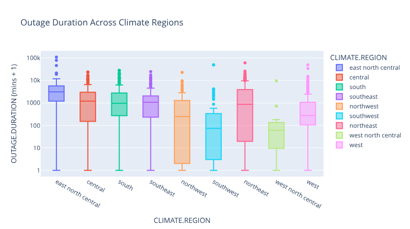

## Question 1
* Which of the three datasets did you choose? Why?
  
    **Re**: While Alaska and Hawaii are excluded, this dataset provides a comprehensive view of power outage risks across the continental United States. The vast geographic footprint of the U.S. naturally gives rise to distinct "micro-regions," each uniquely characterized by specific climates, land-use patterns, electricity consumption habits, and economic profiles. Grid stability is an undeniable pillar of both national security and everyday modern life. This dataset allows us to look under the hood and systematically analyze the root causes of major grid failures that bring local economies to a screeching halt. By combining technical outage logs with socioeconomic indicators like state GSP and urbanization percentages, we can move beyond basic event tracking into actionable, predictive modeling.

---

## Question 2
*  Upload a screenshot of a plotly visualization you’ve created while completing Part 1, Step 2: Data Cleaning and Exploratory Data Analysis.

---

## Question 3
* What is the pair of hypotheses you plan on testing in Part 1, Step 4? What is the test statistic you plan on using?

### Option 1: Weather vs. Equipment Resilience (Duration)
  * **Null Hypothesis**: There is no difference in the average outage duration between power outages caused by severe weather and power outages caused by equipment failure.

  * **Alternative Hypothesis**: The average outage duration for power outages caused by severe weather is significantly different from the average outage duration for power outages caused by equipment failure.

  * **Test Statistic**: The absolute difference in sample means between the two groups. This is chosen alongside a permutation test because our univariate analysis proved the duration data is heavily skewed, violating the strict normality assumptions of parametric tests.

### Option 2: Urbanization Impact (Customers Affected)
  * **Null Hypothesis**: There is no difference in the median number of customers affected by outages in highly urbanized states (e.g., POPPCT_URBAN > 80%) compared to less urbanized states.

  * **Alternative Hypothesis**: Highly urbanized states experience a significantly higher median number of affected customers during outages than less urbanized states.

  * **Test Statistic**: The difference in sample medians between the two groups. The median is chosen over the mean because the CUSTOMERS.AFFECTED distribution contains extreme upper outliers (massive, multi-million user outages) that would heavily distort a standard mean calculation.

### Option 3: Climate Extremes (Demand Loss)
  * **Null Hypothesis**: The distribution of initial power grid demand loss (`DEMAND.LOSS.MW`) is identical whether an outage occurs during a *cold* climate category or a *warm* climate category.

  * **Alternative Hypothesis**: The distribution of power grid demand loss significantly differs between cold and warm climate categories.

  * **Test Statistic**: The Kolmogorov-Smirnov (KS) statistic or Total Variation Distance (TVD). This test statistic is ideal because it compares the entire shape and spread of the two demand loss distributions rather than just their central tendencies.

### Option 4: Regional vs. State-Level Disparities (Outage Duration)
  * **Null Hypothesis**: The average outage duration (`OUTAGE.DURATION`) within a specific region (e.g., `NERC.REGION` or `CLIMATE.REGION`) does not significantly vary between its constituent states (`U.S._STATE`).
  * **Alternative Hypothesis:** The average outage duration within a specific region does significantly vary between its constituent states.
  * **Test Statistic:** The maximum absolute difference in mean outage durations between any two states within the selected region (or an ANOVA F-statistic). This is chosen because it effectively quantifies the dispersion of continuous duration averages across multiple categorical state groups simultaneously.

---

## Question 4
* What is the column you plan on trying to predict in Part 1, Steps 5-8? Is it a classification or regression problem?

### Option 1: Root Cause Classification

  * **Target**: `CAUSE.CATEGORY`

  * **Type**: Multiclass Classification

  * **Justification**: Predicting the fundamental root cause of an outage using regional climate data, temporal features, and local economic indicators is a multiclass classification problem because the target consists of discrete, non-numeric categories.

### Option 2: Outage Duration Forecasting

  * **Target**: `OUTAGE.DURATION`

  * **Type**: Regression

  * **Justification**: Forecasting the exact length of time an outage will last based on the initial megawatt demand loss, start time, and geographic location is a regression problem because the target variable is a continuous numerical measurement.

### Option 3: Hurricane Impact Detection

  * **Target**: `IS_HURRICANE` (The binary classifier feature created during cleaning)

  * **Type**: Binary Classification

  * **Justification**: Identifying whether a major grid failure was specifically driven by a hurricane based purely on its geographic footprint, duration, and magnitude of customers affected is a binary classification problem.

### Option 4: Severe Weather Duration Forecasting 
  * **Target:** `OUTAGE.DURATION` (Filtered to subset where `CAUSE.CATEGORY` == 'severe weather', utilizing `U.S._STATE` as a key feature)

  * **Type:** Regression

  * **Justification:** Forecasting the exact length of time an outage will last in minutes—specifically under the localized stress of severe weather events—is a regression problem because the target variable remains a continuous numerical measurement.

---
